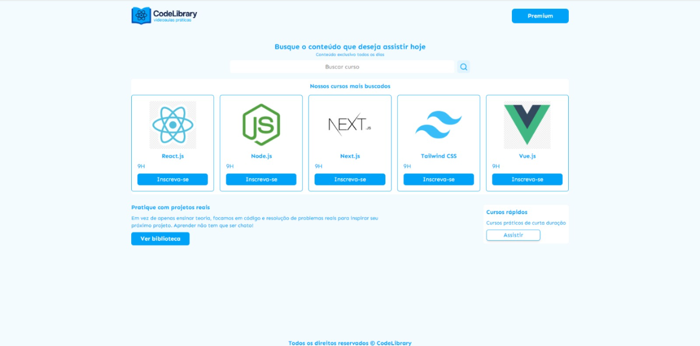

# CodeLibrary

Interface de descoberta de cursos construída com React, TypeScript e Tailwind CSS.

## Objetivo

Projeto desenvolvido com foco em:

- Componentização e reutilização (ex: `<Card />` usado 5x com props diferentes)
- Tipagem de props com TypeScript
- Estilização com Tailwind CSS

## Tecnologias

- React 18
- TypeScript
- Tailwind CSS
- Vite

## Como Rodar

npm install
npm run dev

## Funcionalidades

- Interface de busca de cursos
- Cards de cursos com props dinâmicas
- Seção de cursos rápidos

## Status

✅ Concluído — apenas interface, sem backend.
